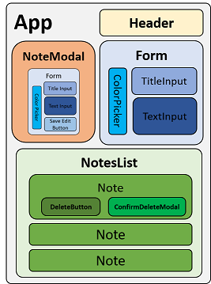

## React.JS Project #1: :memo: Notes App
# Milestone :eight: v1.0
**Milestones 1-8 are ready for review: Would appreciate as much feedback as possible, both positive and negative** :pray:

[App Deployed on Netilfy](https://inspiring-gumption-6e0762.netlify.app/)

**Code Design**:  \
 \
**UI/UX Design**: It is responsive (I used Bootstrap), but my main focus was to deign it as a "mobile app" (people mostly use notes on their mobile device)
### *Progress:*
- Milestone 1: Add :heavy_check_mark:
- Milestone 2: Delete :heavy_check_mark:
- Milestone 3: Title :heavy_check_mark:
- Milestone 4: Modal :heavy_check_mark:
- Milestone 5: Input :heavy_check_mark:
- Milestone 5.1: Auto-resize :heavy_check_mark:
- Milestone 6: Edit :heavy_check_mark:
- Milestone 7: Deployment :heavy_check_mark:
- Milestone 8: Storage :heavy_check_mark:
- Milestone 9: Archive WIP
- Milestone 10: Reminder WIP

### :basketball: Vadim Gringauz :basketball:

